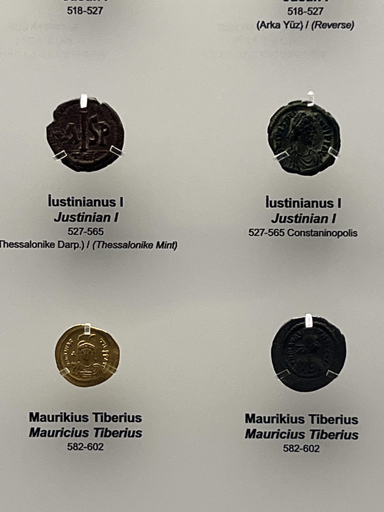

Quran sometimes throws in words from other languages. Let's take words like Darham and more.

### When yousuf was sold
Allah's playing 4D chess, going for "Darahim" in the Yousuf story instead of "Dinar." Why? "Dinar" would be all about coins, but "Darahim," straight from Sanskrit, brings that fixed trade value vibe. Allah, dropping knowledge ahead of the coin game that only kicked in during Justinian's time around 541 CE. Peep the Turkish museum pic – that coin truth! 

And there's more! "Dirham" not only links to trade values but also possibly points to Ibrahim's origin - the Indus Valley Civilization. Mohenjo-daro, a candidate for the people of 3aad, even created Iram, those water-running structures made of Imad, which are basically pillar-like wells.

The Quran's got these linguistic gems that are like time capsules: Samri with those Sumerian vibes, Rum repping Rome, Harut connecting to Inana and Ishtar, Marut nodding to Marduk, and then Easa, Musa, Imran, Luqman, Azar – each one holding a unique cultural story. It's like a linguistic journey, keeping the richness alive. 🌍

### Disjointed letters
Before Arabic took the stage, languages in Afroasiatic, Hebrew, Phoenician, Persian, and Roman areas were all about those disjointed letters. It was a linguistic playground!

In the proto-Semitic language, the trio ALIF, LAAM, MEEM had a star role, meaning God. 𐤀𐤋𐤌‎ (alif lam mim) — <cite>[^1]</cite>
[^1]: The above translation is from Wikitionary [Link](https://en.wiktionary.org/wiki/%F0%90%A4%80%F0%90%A4%8B%F0%90%A4%8C)

It's also buddies with [AL]( https://en.wiktionary.org/wiki/%F0%90%A4%80%F0%90%A4%8B#Phoenician ), EL, a term Jews still toss around for God.

The Quran isn't just a book; it's a linguistic rollercoaster, weaving words from different times and places. it keeps the ride interesting!